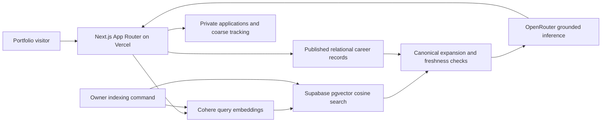

# Resume Builder

A personal career knowledge base and public portfolio. Recruiters can explore
structured experience, ask questions grounded in published evidence, and compare
a role with relevant work. The résumé is another view of the same career records.

The repository starts with a clearly labeled fictional portfolio. It contains
no owner biography or real job applications. Replacing the fixture with approved
career information is an explicit publishing step.

## What works

- Responsive portfolio with experience, projects, and connected skill cards.
- Ask About Me and job-description analysis: validated server endpoints,
  offline fixture responses, and configurable live OpenRouter inference.
- Cohere semantic retrieval: Embed v4, 1024-dimensional vectors, cosine search
  and HNSW in Supabase PostgreSQL, followed by canonical evidence expansion.
- Synchronous indexing with deterministic content hashes. Unchanged records
  are skipped; changed models are re-embedded; unpublished vectors are removed.
- Printable HTML résumé with browser Save as PDF.
- Two saved anonymous workspaces, follow-up questions, private topic signals,
  and conservative evidence expansion.
- Typed Resume IR, an adaptable résumé template, and separate print/PDF or text
  workspace export. Compilation selects canonical facts using explored relevance.
- US/Bulgaria presentations with tracking-market priority and manual selection.
- Supabase Auth protected owner overview, question/topic inspection, and
  tracking-link generation with actual retained metrics.
- Private short-link mappings, 48-bit random codes, anonymous landing events,
  signed 24-hour cookies, privacy-signal opt-out, and retention cleanup.
- Account membership RLS, idempotent owner bootstrap, tenant-scoped retrieval and provenance.
- Career Master text/Markdown import with Luna Pro extraction, stable-key diffs, owner review/edit/reject, transactional acceptance and explicit publication.
- General, job-targeted and record-focused interviews with explainable gap/novelty ranking; conversational answers return through the same review pipeline.
- Existing-user email authentication and gated Google/GitHub PKCE flows.
- Committed migrations, shared AI quotas, tests, and CI.

**Scaffolded:** richer application history and additional tracking event types.
**Planned:** project showcase/media management, interactive category/skill exploration,
Quick Answers with staleness, application experiments, visitor quotas/Turnstile,
credit ledger/trial foundations, and retrieval/grounding evaluation,
more sophisticated tailoring, automatic PDF files, and richer skill navigation.
Compilation selects canonical text without rewriting accomplishments. There is
no admin CMS or visitor identification.

## Architecture

One application, one relational database, two narrowly scoped AI providers.



Stack: Next.js 16, React 19, TypeScript, App Router, Tailwind CSS 4, Zod,
Supabase JS, native provider HTTP APIs, Vitest, ESLint, and Prettier. Installed
versions are pinned in `package.json` and locked in `package-lock.json`.
PGlite is a **test-only** PostgreSQL runtime, not application infrastructure.

## Run locally

Use Node 24 LTS and npm.

```bash
npm ci
cp .env.example .env.local
npm run dev
```

On PowerShell use `Copy-Item .env.example .env.local`. Open
[localhost:3000](http://localhost:3000). The default example sets `APP_MODE=demo`:
no Supabase, Cohere, or OpenRouter account is needed. Demo retrieval uses
deterministic keyword matching; it does not pretend to be semantic search.
`/r/demoLink` exercises redirects and cookies without storing events.

```bash
npm run format
npm run check
npm run build
npm run reindex
```

Production requires an explicit `APP_MODE=demo` or `APP_MODE=live`. Missing live
configuration fails during server initialization. Demo production is permitted
only as an explicitly labeled preview. Live data failures never silently switch
to fictional content.

## Enable real data and AI

Follow [SETUP.md](docs/SETUP.md) for credentials, migrations, publishing, indexing,
and deployment. The live environment requires `NEXT_PUBLIC_SITE_URL`,
`NEXT_PUBLIC_SUPABASE_URL`, `SUPABASE_SECRET_KEY`, `COHERE_API_KEY`,
`OPENROUTER_API_KEY`, and `OPENROUTER_MODEL`. Cohere defaults to `embed-v4.0` at
1024 dimensions. The publishable Supabase key is documented for optional future
browser reads; the current app loads career data on the server.
Owner access needs that publishable key and `OWNER_USER_ID`, the UUID of an
owner-created Supabase Auth user. There is no public administrator signup.

```bash
npx supabase login
npx supabase link --project-ref YOUR_PROJECT_REF
npx supabase db push
npm run reindex
```

Both embedding and generation calls run server-side. No secrets have a
`NEXT_PUBLIC_` prefix. Changing OpenRouter models needs no code change; select a
model supporting JSON Schema structured outputs. Changing Cohere models
requires `npm run reindex`. Changing vector dimension requires a migration and
full reindex, rather than merely changing an environment value.

## Deployment

GitHub is the canonical source. Import the repository into Vercel, use the Next.js
framework preset, add environment variables, and deploy from `main`. Supabase
migrations are applied explicitly through its CLI. No Docker, Railway, queues,
Redis, or custom hosting scripts are required. The canonical production domain is
[resume-builder-amber-sigma.vercel.app](https://resume-builder-amber-sigma.vercel.app).

## Privacy and security

- RLS exposes only approved career rows. Private tables, vector records, and
  privileged RPCs have no browser access. Defaults are unpublished.
- Public AI input is validated and size-bounded. A database row lock enforces
  10 requests per minute and 100 per database day across server instances.
  This bounds spending globally; it is not a per-person identity mechanism.
- Prompts restrict claims to retrieved evidence; response schemas, reference
  IDs, and skill names are checked. Free-text factual grounding still requires
  evaluation: citation checks cannot prove that every generated sentence is true.
- The application does not log question/job-description content. Live workspaces
  privately save descriptions, questions, answers, evidence references, and topic
  signals for exploration and owner analytics. Visitors can delete their workspace.
  Demo workspaces remain in local storage. Inactive live workspaces are pruned
  after 90 days when cleanup runs. Live inputs use Cohere and OpenRouter, whose retention policies
  must be reviewed before publishing confidential career material.
- Link analytics record only a random session, link, event type, and timestamp.
  No stored IP addresses, fingerprints, identities, or keystrokes. DNT/GPC disables
  tracking. Retention cleanup deletes events older than 90 days on new writes;
  invoke the cleanup RPC for inactive portfolios that need immediate expiry.

The current npm audit reports an unpatched `braces` denial-of-service advisory
through the Next.js **development lint tooling**. No vulnerable production
dependency was reported. Do not run lint with attacker-controlled glob patterns;
update the tooling when a patched release becomes available. See
[the upstream advisory](https://github.com/advisories/GHSA-vfj7-8cjw-p6xm).

## Repository map

```text
src/app/             Portfolio, résumé, privacy, AI APIs, short links
src/components/      Small interactive components
src/lib/career/      Typed fixtures, published repository, deterministic retrieval
src/lib/embeddings/  Semantic text, Cohere, indexing, canonical expansion
src/lib/ai/          Grounded prompts, OpenRouter, contracts, orchestration
src/lib/tracking/    Codes, signed sessions, private persistence
src/lib/workspaces/  Browser identity, persistence, context and readable exports
src/lib/resume-ir.ts Canonical facts compiled for application-owned templates
scripts/             Owner-only indexing and tracking inspection
supabase/migrations/ Relational schema, RLS, quota, pgvector and search RPC
tests/               Pure/provider/API tests and executable database tests
docs/                Architecture and service setup
.github/workflows/   Formatting, lint, types, tests, build
```

The next useful iteration is using `/admin/career` to review a small set of approved owner records and
evaluating retrieval and workspace résumé selection with recruiter questions.
